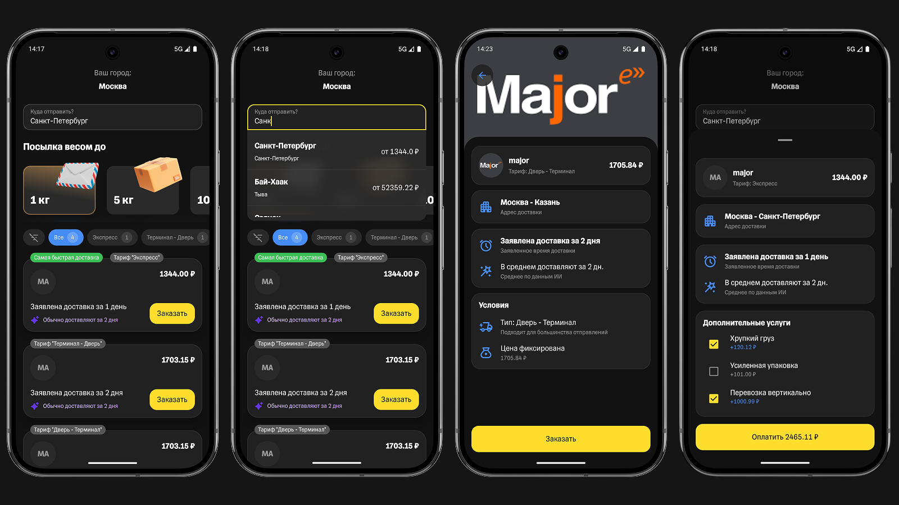

# Т-Доставка

**Краткое описание:**

Приложение помогает пользователю выбрать лучший вариант доставки из Москвы в любой город.

[Скриншоты](snapshots)

[.apk файл](app-release.apk)

Основной пользовательский сценарий:

1. Пользователь выбирает город и вес

2. Сервис показывает:

   • варианты доставки разных компаний,

   • стоимость именно для его веса,

   • сроки доставки,

   • типы тарифов (Экспресс / Сборный груз),

   • какие данные реальные, а какие спрогнозированные.

3. Клиент выбирает лучший вариант.

Архитектура: MVVM, Coroutines, Dagger Hilt для DI. UI на Jetpack Compose.

[Подробнее про архитектуру](docs/Architecture.md)

Тестирование: в проекте есть ui, компонентные и unit тесты, а также написан happy path тест для
ручного тестирования.

[Подробнее про тесты](docs/Testing.md)

---

# 🖼 Список экранов

⚠️
В данном документе мы смотрим на экран с точки зрения бизнеса. То есть экран для нас - это сущность
закрывающая какую-либо потребность пользователя. Так, экраном может считаться bottom sheet, обычный
экран или модальное окно.

## 1. Главный экран

**Продуктовое назначение:** Подбор предложений от различных перевозчиков под требования
пользователя.

**Основной функционал:**

- Ввод города
- Ввод веса посылки
- Отображение списка релевантных предложений
- Фильтрация списка

**Связь с другими экранами:**

Экран является точкой входа в приложение.

Можно перейти на:

- Экран деталей предложения
- Экран заказа

**Связь с бэкендом:**

- GET `/cities/search` - поиск городов
- POST `/delivery/calculate` - подбор релевантных предложений на основе ML
- GET `/attachments/{id}/content` - загрузка изображений

---

## 2. Экран деталей предложения

**Продуктовое назначение:** Ознакомление пользователя с более подробными условиями предложения.

**Основной функционал:**

- Отображение информации о компании
- Отображение тарифа и стоимости
- Отображение городов, между которыми происходит доставка
- Отображение сроков доставки
- Возможность перейти к оформлению заказа

**Связь с другими экранами:**

На экран можно попасть из:

- Главного экрана

Можно перейти на:

- Главный экран
- Экран заказа

**Связь с бэкендом:**

- GET `/delivery/offers/{id}` - получение подробной информации о предложении
- GET `/attachments/{id}/content` - загрузка изображений

---

## 3. Экран заказа

**Продуктовое назначение:** Формирование итогового оффера для пользователя. Резюме по его выбору +
предложение дополнительных опций(страховка и т.п.).

**Основной функционал:**

- Отображение информации о компании
- Отображение тарифа и стоимости
- Отображение городов, между которыми происходит доставка
- Отображение сроков доставки
- Предложение доп. услуг
- Оплата(ее эмуляция)

**Связь с другими экранами:**

На экран можно попасть из:

- Главного экрана
- Экрана деталей предложения

Можно перейти на:

- Главный экран
- Экран деталей предложения
- Экран подтверждения заказа

**Связь с бэкендом:**

- GET `/delivery/offers/{id}/details` - формирование заказа на основе одного из предложений

**Статус разработки:** 🛠 В процессе

---

## 4. Экран подтверждения заказа

**Продуктовое назначение:** Подтверждение заказа пользователю, предоставление трек-номера.

**Основной функционал:**

- Отображение трек-номера
- Возможность перейти в Т-Банк для отслеживания заказа

**Связь с другими экранами:**

На экран можно попасть из:

- Экрана заказа

Можно перейти на:

- Главный экран
- Экран деталей предложения

---